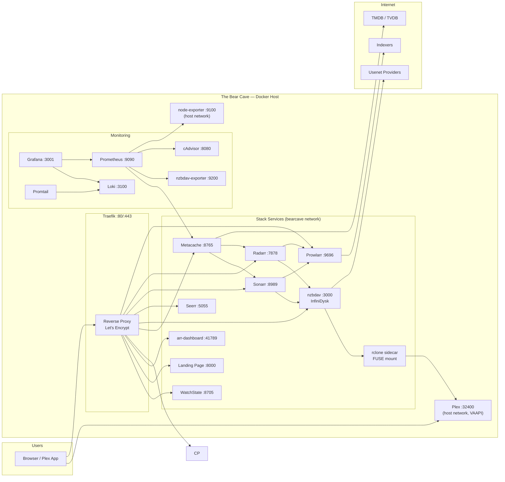
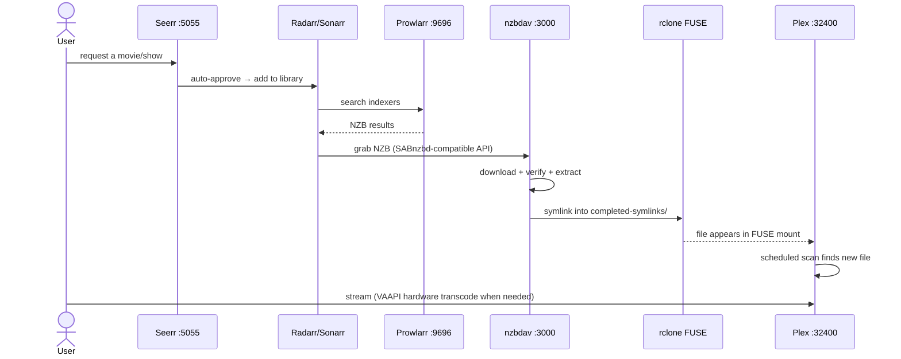
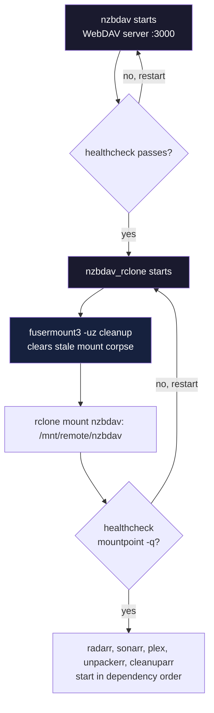
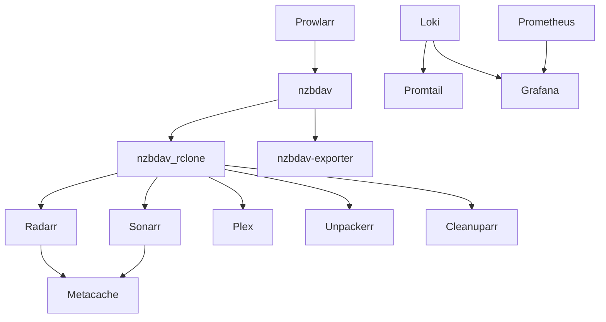
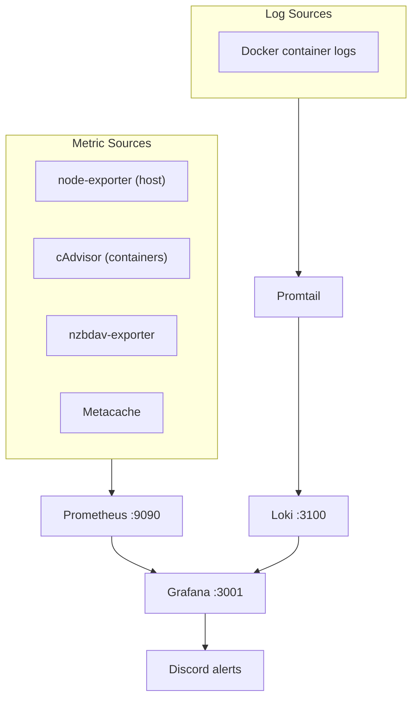

# Architecture

The Bear Cave is a single-host media acquisition and serving stack: 22 containers
orchestrated by one `docker-compose.yml`, fronted by Traefik, served by Plex.

---

## 1. System Overview



---

## 2. Network Topology

Three networking modes are used deliberately:

```mermaid
flowchart TB
    subgraph host["host network (no isolation)"]
        Plex["Plex<br/>:32400"]
        NExp["node-exporter<br/>:9100"]
    end

    subgraph bearcave["bearcave bridge network"]
        subgraph traefik["traefik network"]
            T["Traefik<br/>:80 :443"]
        end
        Prow["Prowlarr :9696"]
        Rad["Radarr :7878"]
        Son["Sonarr :8989"]
        NZB["nzbdav :3000"]
        RCL["rclone :5572 RC"]
        Seerr["Seerr :5055"]
        Meta["Metacache :8765"]
        ARR["arr-dashboard :41789"]
        LP["Landing Page :8000"]
        WS["WatchState :8705"]
        Graf["Grafana :3001"]
        Prom["Prometheus :9090"]
        Loki["Loki :3100"]
    end

    T --- Prow & Rad & Son & NZB & Seerr & Meta & CP & ARR & LP & WS & Graf
    RCL -. FUSE mount -> Plex
    Prom -. "host.docker.internal" .-> NExp
```

| Network | Services | Why |
|---------|----------|-----|
| **bearcave** | All stack services | Internal service-to-service DNS (e.g. `http://radarr:7878`) |
| **traefik** | Traefik + everything it routes | Traefik needs to reach containers on the bridge network |
| **host** | Plex, node-exporter | Plex: GDM discovery, DLNA, and NAT-PMP/UPnP are unreliable on bridge. node-exporter: needs host PID/net namespaces for real host metrics |

**Plex is the only service that cannot be proxied** — it deliberately bypasses Traefik.
Access it directly at `http://HOST_IP:32400`.

---

## 3. Content Pipeline (data flow)



**Every media file is a symlink into the FUSE mount.** Zero real media bytes live on
local disk. The only real files on disk are config, databases, and caches.

---

## 4. FUSE Mount Lifecycle

The rclone sidecar is the most fragile part of the stack — this diagram shows why
ordering matters:



### Critical rules

1. **Never restart the mount owner alone.** Restart `nzbdav_rclone`, then every dependent
   (radarr, sonarr, plex, unpackerr, cleanuparr) in order.
2. **`depends_on: restart: true`** means any nzbdav restart cascades to rclone and
   dependents automatically. This is by design.
3. **Stale mount self-heal:** the entrypoint runs `fusermount3 -uz` / `umount -l` before
   mounting, so a crash-looped rclone (which leaves a dead FUSE mount) recovers on next
   start instead of refusing to remount.
4. **Never `sudo umount` a FUSE mountpoint.** It leaves dependents holding a defunct handle.

---

## 5. Dependency Chains



| Service | `depends_on` (health-gated) | Cascade risk |
|---------|----------------------------|--------------|
| nzbdav | prowlarr healthy | — |
| nzbdav_rclone | nzbdav healthy, restart | nzbdav restart → rclone restart |
| radarr / sonarr | nzbdav_rclone healthy, restart | **any rclone restart → app restart** |
| plex | nzbdav_rclone healthy, restart | same |
| unpackerr / cleanuparr | nzbdav_rclone healthy, restart | same |
| promtail | loki healthy | — |
| grafana | loki + prometheus healthy | — |
| nzbdav-exporter | nzbdav healthy | — |

---

## 6. Metadata Flow (Metacache)

```mermaid
flowchart LR
    Plex[Plex] -->|"match + metadata requests"| Meta[Metacache :8765]
    Rad[Radarr] -->|"warm /webhook"| Meta
    Son[Sonarr] -->|"warm /webhook"| Meta
    Meta -->|"cache hit"| DB[(SQLite cache)]
    Meta -->|"cache miss"| TMDB[TMDB]
    Meta -->|"episode fallback"| TVDB[TVDB]
    DB --> Img[(Image cache /img/{hash})]
    Img --> Plex
```

- Plex is registered with Metacache as a **Custom Metadata Provider** (PMS 1.43+)
- Metacache warms from Radarr/Sonarr libraries nightly + on import webhooks
- Artwork URLs are rewritten to `http://HOST_IP:8765/img/{hash}` so Plex never hits the internet
- TMDB/TVDB keys never appear in cache keys or logs

---

## 7. Observability Stack



| Tool | Role | Data source |
|------|------|-------------|
| Prometheus | Metrics storage (30d retention) | node-exporter, cAdvisor, nzbdav-exporter, metacache, self |
| Loki | Log aggregation | Promtail → Docker json logs |
| Grafana | Dashboards + alerting | Prometheus + Loki datasources |
| Discord | Alert notifications | Grafana contact point + Watchtower webhook |

---

## 8. Request/Response Paths

| URL pattern | Target | Example |
|-------------|--------|---------|
| `http://HOST_IP:32400` | Plex (direct, not proxied) | `http://192.168.1.100:32400/web` |
| `https://arr.HOST_IP.nip.io` | arr-dashboard | |
| `https://radarr.HOST_IP.nip.io` | Radarr | |
| `https://sonarr.HOST_IP.nip.io` | Sonarr | |
| `https://prowlarr.HOST_IP.nip.io` | Prowlarr | |
| `https://seerr.HOST_IP.nip.io` | Seerr | |
| `https://nzbdav.HOST_IP.nip.io` | InfiniDysk | |
| `https://metacache.HOST_IP.nip.io` | Metacache | |
| `https://watchstate.HOST_IP.nip.io` | WatchState | |
| `https://grafana.HOST_IP.nip.io` | Grafana | |
| `https://traefik.HOST_IP.nip.io` | Traefik dashboard | |
| `https://bearcave.HOST_IP.nip.io` | Landing page | |

**Planned (per `stack-expansion-spec.md`, not yet deployed):**

| URL pattern | Target | Example |
|-------------|--------|---------|
| `https://lidarr.HOST_IP.nip.io` | Lidarr (music) | |
| `https://readarr.HOST_IP.nip.io` | Readarr (ebooks) | |
| `https://bazarr.HOST_IP.nip.io` | Bazarr (subtitles) | |
| `https://audiobookshelf.HOST_IP.nip.io` | Audiobookshelf | |
| `https://komga.HOST_IP.nip.io` | Komga (comics) | |
| `https://adguard.HOST_IP.nip.io` | AdGuard Home (web UI; DNS on :53) | |
| `https://uptime-kuma.HOST_IP.nip.io` | Uptime Kuma (**slip-gated**) | |
| `https://vaultwarden.HOST_IP.nip.io` | Vaultwarden | |
| `https://n8n.HOST_IP.nip.io` | n8n (workflows) | |

Crowdsec has **no** nip.io route (LAPI is an API for bouncers/`cscli`, not a
web UI — see `docs/services/crowdsec.md`). Add each row to the live table above
when its phase deploys.

> **Note:** `.nip.io` resolves any `*.IP.nip.io` to that IP with no DNS setup. For real
> hostnames, replace with your own domain in the Traefik labels.

---

## 9. Storage Layout

```
TheBearCave/
├── services/<app>/config/     ← app state (gitignored, contains secrets)
├── config/plex/      ← full Plex library DB (~33 GB)
├── media/{movies,shows,...}   ← symlinks into FUSE mount (gitignored content)
├── data/                      ← loki, prometheus, grafana, metacache DBs
├── secrets/                   ← Docker secrets source files (gitignored)
├── config/traefik/            ← Traefik static config
└── archive/                   ← legacy files from media-stack + metacacharr
```
