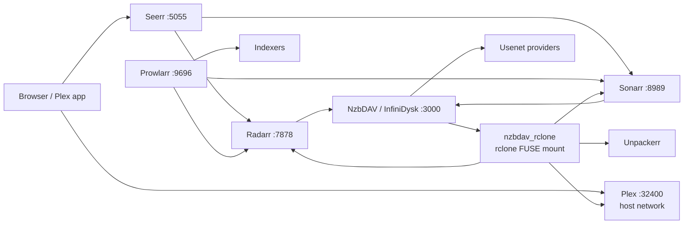
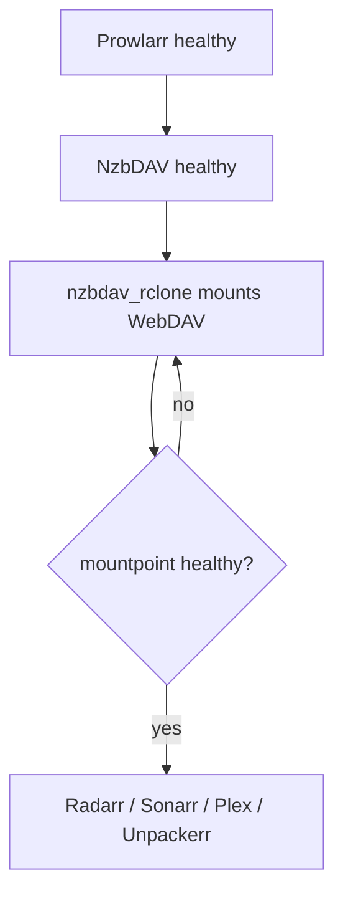

# Architecture

The Bear Cave is a single-host, eight-service media acquisition and serving stack.
It uses direct host ports, one private Docker bridge network, and Plex on host
networking. There is no reverse proxy, dashboard portal, or observability tier in
the active deployment.

## System overview



### Content flow

1. Prowlarr supplies indexers to Radarr and Sonarr.
2. Seerr creates movie and TV requests in Radarr or Sonarr.
3. The *arr applications submit NZBs to NzbDAV through its SABnzbd-compatible API.
4. NzbDAV downloads and exposes the completed tree through WebDAV.
5. `nzbdav_rclone` mounts that WebDAV tree at `/mnt/remote/nzbdav` using FUSE.
6. Radarr, Sonarr, Unpackerr, and Plex consume the shared mount.
7. Plex scans `/data/movies` and `/data/shows`, which contain links into the mount.

No real media bytes are intended to live in the local media directories; the
remote WebDAV/FUSE tree is the source of truth.

## Network topology

| Network | Services | Purpose |
|---------|----------|---------|
| `bearcave` bridge | Prowlarr, Radarr, Sonarr, NzbDAV, `nzbdav_rclone`, Seerr, Unpackerr | Internal DNS and service-to-service traffic |
| `host` | Plex | GDM, DLNA, remote-access negotiation, and direct `:32400` access |

Published service ports are deliberately direct and LAN-scoped by host firewall
policy:

| Port | Service |
|------|---------|
| 3000 | NzbDAV |
| 5055 | Seerr |
| 7878 | Radarr |
| 8989 | Sonarr |
| 9696 | Prowlarr |
| 32400 | Plex |

There is no HTTPS termination layer in Compose. If remote access is required,
provide it with a separately managed VPN or reverse proxy rather than adding an
unreviewed container to this stack.

## FUSE lifecycle and dependency cascade



`nzbdav_rclone` is the mount owner. Radarr, Sonarr, Plex, and Unpackerr have a
health-gated dependency on it and use `restart: true`, so an NzbDAV or rclone
restart intentionally restarts every FUSE consumer.

Rules:

- Confirm the NzbDAV queue is empty before recreating NzbDAV.
- Confirm `docker exec nzbdav_rclone mountpoint -q /mnt/remote/nzbdav` before a Plex scan.
- Never force-unmount the FUSE tree while consumers are running.
- The rclone entrypoint clears stale mount state before mounting.
- After a mount-owner restart, wait for the dependents to become healthy before
  checking library state.

## Application paths

The same paths must be used in the databases and containers:

| Application | Path |
|-------------|------|
| Radarr | `/data/movies` |
| Sonarr | `/data/shows` |
| Plex | `/data/movies`, `/data/shows` |
| Shared remote mount | `/mnt/remote/nzbdav` |

Changing these paths in Compose without recreating the affected consumers causes
healthy-looking containers with inaccessible root folders or apparent Plex deletions.

## Storage layout

```text
TheBearCave/
├── config/plex/                 # Plex database and metadata; highest-value state
├── config/{prowlarr,radarr,sonarr}/
├── config/nzbdav/                # NzbDAV database and settings
├── config/nzbdav-rclone/        # rclone.conf and local VFS cache
├── config/seerr/
├── media/{movies,shows}/         # local link trees into the FUSE mount
├── usenet/                       # Unpackerr staging
├── config/ca/                    # optional local CA bundle for outbound TLS
├── secrets/                      # generated secret source files
└── archive/                      # historical retired material; inactive
```

## Operational surface

The supported operator surface is Docker Compose, the scripts under `scripts/`,
the health checks under `tests/health/`, and the Fish functions under
`services/fish-functions/`. Retired services and their removal rationale are
tracked in [services/lifecycle.md](services/lifecycle.md); they are not part of
this architecture.
