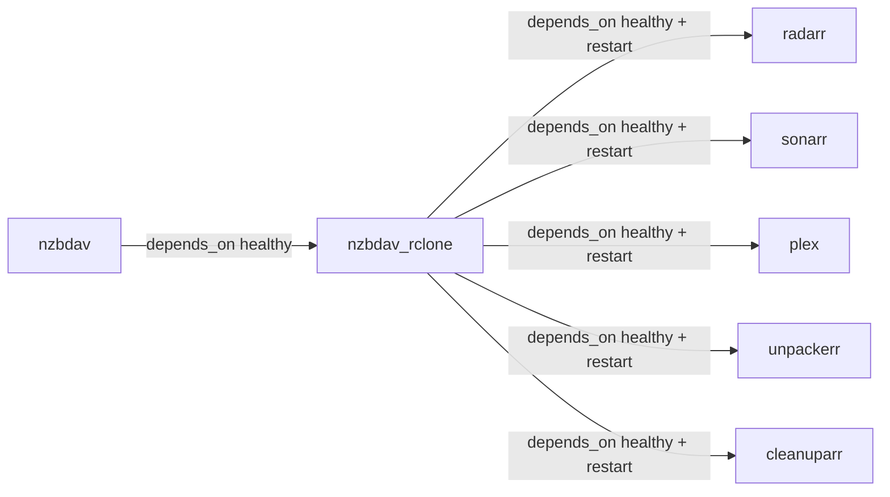

# nzbdav_rclone (FUSE sidecar)

The most critical and most fragile container in the stack. InfiniDysk has **no native
FUSE mount** — it's WebDAV-only — so this rclone sidecar mounts InfiniDysk's WebDAV
tree at `/mnt/remote/nzbdav` and every media consumer reads through it.

| | |
|---|---|
| **Image** | `rclone/rclone:latest` |
| **Ports** | none published; RC API on container `:5572` |
| **Network** | `bearcave` |
| **Healthcheck** | `mountpoint -q /mnt/remote/nzbdav` |
| **Config** | `services/nzbdav-rclone/rclone.conf` (gitignored) + `cache/` |
| **Depends on** | `nzbdav` healthy (restart cascade) |
| **Privileges** | `/dev/fuse`, `SYS_ADMIN` |

## Role

- FUSE-mounts InfiniDysk's WebDAV tree at `/mnt/remote/nzbdav`
- Serves that mount to radarr, sonarr, plex, unpackerr, cleanuparr via `:rslave`
  bind mounts
- VFS cache (full mode, up to 50 GB) makes repeated reads cheap

## Mount options (from compose)

```yaml
command:
  - fusermount3 -uz /mnt/remote/nzbdav 2>/dev/null || true;   # clear stale corpse
    umount -l /mnt/remote/nzbdav 2>/dev/null || true;         # self-heal
    exec rclone mount nzbdav: /mnt/remote/nzbdav
    --vfs-cache-mode=full --vfs-cache-max-size=50G --vfs-cache-max-age=336h
    --dir-cache-time=1h --poll-interval=5m
    --rc --rc-addr=:5572 --rc-user=rclone --rc-pass=${NZBDAV_RCLONE_RC_PASS}
```

The `fusermount3 -uz` / `umount -l` preamble is the **stale-mount self-heal**: a
crash-looped rclone leaves a dead FUSE mount on the host, and without this cleanup
rclone refuses to remount ("directory already mounted") and loops forever.

## rclone.conf

Gitignored. Template at `services/nzbdav-rclone/rclone.conf.template`:

```ini
[nzbdav]
type = webdav
url = http://nzbdav:3000/
vendor = other
user = usenet
pass = <rclone-obscured password, NOT plaintext>
```

Generate the password with `rclone obscure "your-webdav-password"`.

## The cascade (why ordering matters)



`restart: true` means any nzbdav restart cascades through rclone to all five dependents.
That's the designed recovery path — don't fight it.

## Troubleshooting

- **`mountpoint` fails / mount gone** — restart the owner:
  `docker compose restart nzbdav nzbdav_rclone` then dependents:
  `docker compose restart radarr sonarr plex unpackerr cleanuparr`
- **"directory already mounted" loop** — the self-heal preamble should clear it; if not,
  check for a real FUSE mount on the host with `mount | grep nzbdav` and unmount it
  (`umount -l /mnt/remote/nzbdav` — never `sudo umount` a live FUSE mountpoint that
  dependents are using)
- **Everything stat-fails in Plex** — this is the classic "mount is gone" symptom;
  a scan during that window marks items deleted. Recover the mount, then trigger a
  rescan from Plex
- **RC endpoint refused** — `NZBDAV_CONFIG__RCLONE__RC_ENABLED` must be true on nzbdav
  and the RC pass must match `NZBDAV_RCLONE_RC_PASS`
